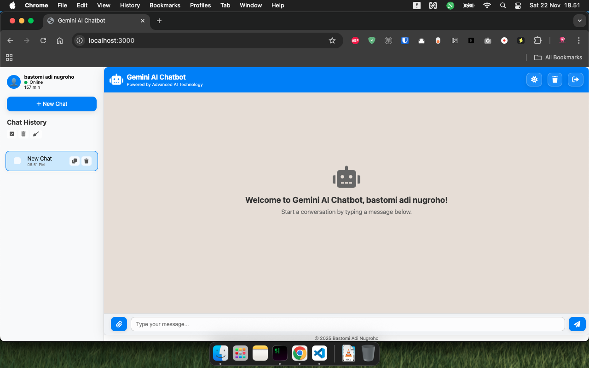
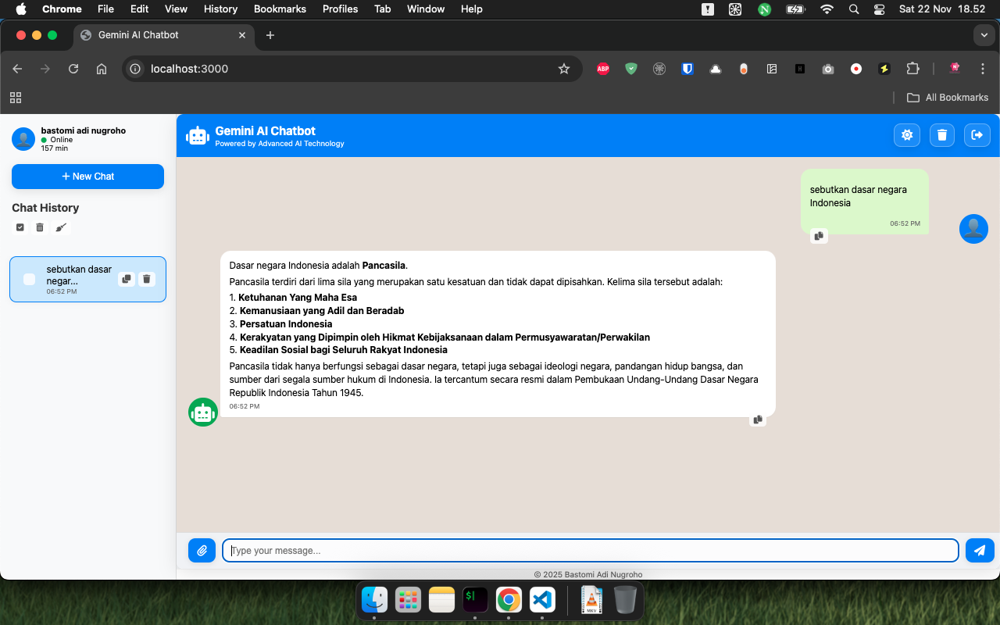
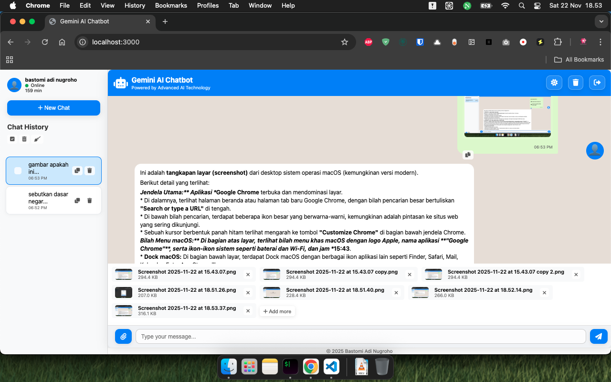

# Gemini AI Chatbot

A modern, feature-rich web-based chatbot powered by Google's Gemini AI, built with Node.js, Express, and vanilla JavaScript. This application provides an intuitive interface for interacting with AI, managing conversations, and handling file attachments.
## Screenshot










## Features

### Core Functionality
- **AI-Powered Conversations**: Chat with Google's Gemini 2.5 Flash model for intelligent responses
- **User Authentication**: Simple login system with name and avatar selection
- **Real-time Chat Interface**: Modern, responsive chat UI with message bubbles
- **File Attachments**: Support for multiple file types including:
  - PDF documents (text extraction)
  - Text files
  - Images (with metadata)
  - Audio files
  - Video files
  - Other file types

### Chat Management
- **Chat History**: Persistent storage of conversation history
- **Multiple Conversations**: Create and manage multiple chat sessions
- **Chat Organization**: Automatic chat titling based on first message
- **Bulk Operations**: Select and delete multiple chats at once
- **Duplicate Chats**: Create copies of existing conversations

### User Interface
- **Dark/Light Theme**: Toggle between themes with smooth animations
- **Responsive Design**: Works on desktop and mobile devices
- **Modern UI Elements**: Glassmorphism effects, rounded buttons, smooth transitions
- **Font Awesome Icons**: Consistent iconography throughout the app
- **Profile Management**: User avatars and status indicators

### Advanced Features
- **Markdown Rendering**: AI responses support headings, lists, code blocks, and formatting
- **Copy Messages**: Easy copying of AI responses to clipboard
- **File Preview**: Selected files are displayed with remove options
- **Session Management**: Persistent user sessions with local storage
- **Error Handling**: Graceful error messages and loading states
- **Toast Notifications**: Non-intrusive feedback for user actions

## Requirements

### System Requirements
- **Node.js**: Version 16.0.0 or higher
- **npm**: Included with Node.js installation
- **Modern Web Browser**: Chrome, Firefox, Safari, or Edge (latest versions recommended)

### API Requirements
- **Google Gemini API Key**: Required for AI functionality
  - Sign up at [Google AI Studio](https://makersuite.google.com/app/apikey)
  - Generate an API key with appropriate permissions

### Dependencies
The application uses the following npm packages:
- `@google/genai`: Google Gemini AI SDK
- `express`: Web framework for Node.js
- `cors`: Cross-origin resource sharing
- `dotenv`: Environment variable management
- `multer`: File upload handling
- `pdf-parse`: PDF text extraction

## Installation

1. **Clone the repository**:
   ```bash
   git clone <repository-url>
   cd gemini-chatbot-api
   ```

2. **Install dependencies**:
   ```bash
   npm install
   ```

3. **Set up environment variables**:
   - Copy `.env.example` to `.env`
   - Add your Gemini API key:
     ```
     GEMINI_API_KEY=your_api_key_here
     GEMINI_MODEL=your_gemini_model
     ```
   - Optionally set a custom port:
     ```
     PORT=3000
     ```

## Running the Application

### Development Mode
```bash
node index.js
```

### Production Mode
For production deployment, consider using a process manager like PM2:
```bash
npm install -g pm2
pm2 start index.js --name "gemini-chatbot"
```

### Accessing the Application
- Open your web browser and navigate to `http://localhost:3000`
- The application will automatically serve the static files and API endpoints

## Usage

### First Time Setup
1. **Login**: Enter your name and select an avatar
2. **Start Chatting**: Type a message or attach files
3. **Theme Toggle**: Use the sun/moon button in the header to switch themes

### Chat Features
- **Send Messages**: Type and press Enter or click the send button
- **Attach Files**: Click the paperclip icon to select files
- **Copy Responses**: Click the copy icon on AI messages
- **Manage History**: Use the sidebar to view, select, and manage chat history

### File Attachments
- Click the attachment button to open file picker
- Select multiple files of supported types
- Preview selected files with remove options
- Files are processed and included in AI context

### Chat History Management
- **View History**: All conversations are listed in the sidebar
- **New Chat**: Click "New Chat" to start a fresh conversation
- **Bulk Selection**: Use checkboxes to select multiple chats
- **Delete Operations**: Delete individual chats or bulk selections
- **Duplicate**: Create copies of existing chats

## API Endpoints

### POST /api/chat
Main chat endpoint that processes user messages and file attachments.

**Request Body**:
```json
{
  "conversation": [
    {
      "role": "user",
      "text": "Hello, how are you?"
    }
  ]
}
```

**File Attachments**: Send as multipart/form-data with field name `files`

**Response**:
```json
{
  "result": "AI response text here"
}
```

## Project Structure

```
gemini-chatbot-api/
├── index.js              # Main server file
├── package.json          # Dependencies and scripts
├── .env                  # Environment variables (create from .env.example)
├── .env.example          # Environment template
├── public/               # Static web files
│   ├── index.html        # Main HTML page
│   ├── style.css         # Stylesheets
│   └── script.js         # Client-side JavaScript
├── .gitignore            # Git ignore rules
└── readme.md            # This file
```

## Configuration

### Environment Variables
- `GEMINI_API_KEY`: Your Google Gemini API key (required)
- `PORT`: Server port (default: 3000)

### File Upload Limits
- Maximum file size: 50MB per file
- Supported formats: PDF, text, images, audio, video, and other files

## Troubleshooting

### Common Issues

**API Key Errors**:
- Ensure your Gemini API key is valid and has proper permissions
- Check that the key is correctly set in `.env`

**File Upload Issues**:
- Verify file size is under 50MB
- Check that the file type is supported

**Port Conflicts**:
- Change the PORT in `.env` if 3000 is in use
- Ensure no other services are running on the specified port

**CORS Issues**:
- The application includes CORS middleware for cross-origin requests

### Development Tips
- Use browser developer tools to inspect network requests
- Check server console for error messages
- Ensure all dependencies are properly installed

## Contributing

1. Fork the repository
2. Create a feature branch
3. Make your changes
4. Test thoroughly
5. Submit a pull request

## License

This project is licensed under the ISC License.

## Credits

- **Google Gemini AI**: For providing the AI model
- **Font Awesome**: For icon library
- **Express.js**: For the web framework
- **Node.js Community**: For the runtime environment

## Support

For issues and questions:
- Check the troubleshooting section
- Review the code comments
- Open an issue on the repository

---

Built with ❤️ using Node.js, Express, and Google's Gemini AI